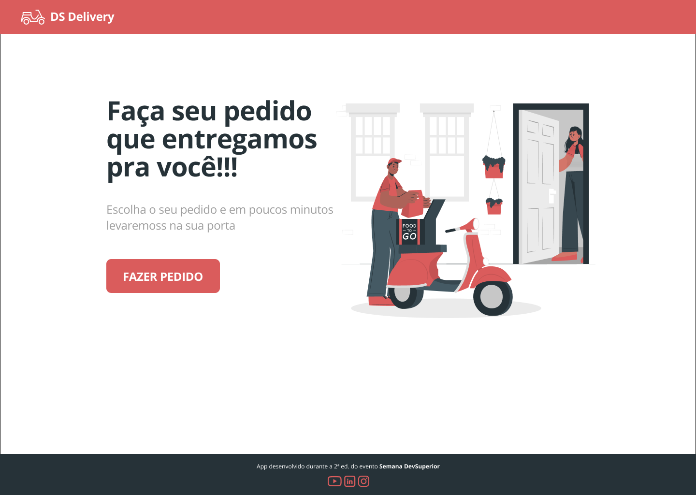

# DS Delivery

<!-- PROJECT SHIELDS -->
[![Issues][issues-shield]][issues-url]
[![MIT License][license-shield]][license-url]
[![LinkedIn][linkedin-shield]][linkedin-url]

<!-- PROJECT LOGO -->
<br />
<p align="center">
  <a href="URL_DO_SEU_PROJETO">
    
  </a>

  <h3 align="center"><strong>O melhor aplicativo de pedidos!</strong></h3>

  <p align="center">
 <strong>Aplicativo criado durante a semana DevSuperior com Back-End Java e Front/Mobile com React</strong>
    <br />
    <a href="https://github.com/mikxingu"><strong>Veja outras soluções »</strong></a>
    <br />
    <br />
    <a href="https://github.com/mikxingu/dsdelivery-sds2/issues">Reporte um Bug</a>
  </p>
</p>

### Feito com

O <strong>DS Delivery</strong> foi implementado usando os seguintes recursos:

* [Java](https://www.oracle.com/java/) - <strong>Linguagem Usada (*JDK 11*)</strong>
* [React](URL_DA_DOC_DA_LINGUAGEM_2) - <strong>A ser atualizado</strong>
* [JavaScript](URL_DA_DOC_DO_JS) - <strong>Usado para a criação de um front-end mais amigável.</strong>


### Instalação

1. Clone o repositório
```sh
https://github.com/NICKNAME_DO_SEU_GITHUB/NOME_DESSE_REPOSITORIO.git
```
2. Execute-o com o comando <strong>X</strong>


<!-- LICENSE -->
## Licença

Distribuído pela MIT License. Consulte o arquivo `LICENSE.txt` para mais informações.

<!-- CONTACT -->
## Contato

<strong>Michel Alves - </strong> michelalvs@gmail.com

<!-- MARKDOWN LINKS & IMAGES -->
[issues-shield]: https://img.shields.io/github/issues/othneildrew/Best-README-Template.svg?style=flat-square
[issues-url]: https://github.com/mikxingu/dsdelivery-sds2/issues
[license-shield]: https://img.shields.io/github/license/othneildrew/Best-README-Template.svg?style=flat-square
[license-url]: https://github.com/mikxingu/dsdelivery-sds2/
[linkedin-shield]: https://img.shields.io/badge/-LinkedIn-black.svg?style=flat-square&logo=linkedin&colorB=555
[linkedin-url]: https://www.linkedin.com/in/michel-alves-almeida-leite-84976315a/
